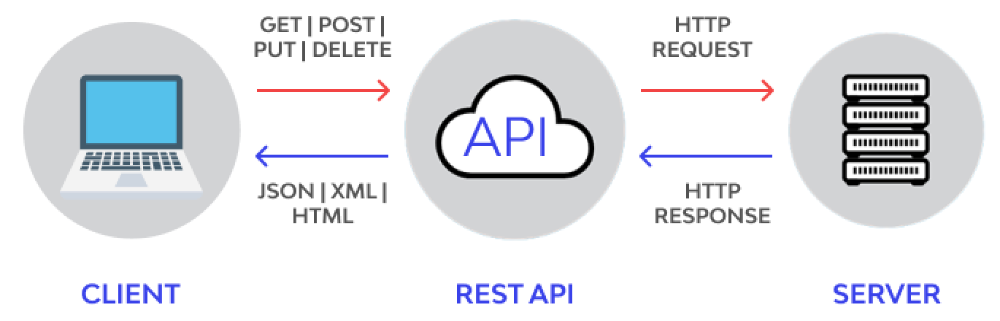

# সহজ বাংলায় REST API

REST API বুঝতে হলে আমাদের সর্বপ্রথম বুঝতে হবে API কি এবং কেন এটি ব্যবহার করা হয়। তারপর REST API কী এবং এর বৈশিষ্ট্যগুলো বিস্তারিতভাবে ব্যাখ্যা করা হবে।
## API কী?  
ধরা যাক, আপনি ঢাকা থেকে কিশোরগঞ্জ ট্রেনের একটি টিকিট কাটতে চান। তাই আপনি ট্রেনের রিজার্ভেশন অ্যাপে ঢুকলেন। সেখানে আপনি স্টেশনের নাম, সময়, তারিখ, এবং ক্লাস নির্বাচন করে "সার্চ" বাটনে ক্লিক করলেন এবং আপনার দেওয়া ডেটার ভিত্তিতে টিকিটের ইনফরমেশন দেখালো।

এখন এখানে:
- **আপনি:** Client (ব্যবহারকারী)।
- **অ্যাপ:** আপনার Interface (ট্রেনের রিজার্ভেশন অ্যাপ)।
- **API:** মাধ্যম, যা ট্রেন কোম্পানির সার্ভার থেকে ডেটা এনে আপনাকে দেখায়।
- **সার্ভার:** ডেটাবেস, যেখানে সমস্ত ট্রেনের শিডিউল, আসন সংখ্যা, এবং ভাড়ার তথ্য সংরক্ষিত থাকে।


## মূল বিষয়
API হলো Application Programming Interface, যা ক্লায়েন্ট (আপনি) এবং সার্ভার (ডেটাবেস) এর মধ্যে যোগাযোগ করিয়ে দেয়ার কার্যকরী মাধ্যম। এটি নিশ্চিত করে যে আপনি আপনার প্রয়োজনীয় তথ্য কত সহজে এবং দ্রুত পাচ্ছেন।

---
এখন আসা যাক REST API এর আদ্যোপান্তে
## REST API: সহজ ব্যাখ্যা

ধরা যাক, আপনি এমন একটি রেস্তোরাঁতে গেছেন, যা অন্যান্য রেস্তোরাঁ থেকে আরও উন্নত এবং সুশৃঙ্খল। এখানে মেনু, অর্ডার এবং ডেলিভারির প্রতিটি ধাপ নির্দিষ্ট নিয়মের মধ্যে পরিচালিত হয়। ঠিক সেভাবেই, একটি API-কে যখন নির্দিষ্ট কিছু নিয়ম এবং নীতিমালার ভিত্তিতে সাজানো হয়, তখন ডাটা আদান প্রদান করতে সুবিধা হয় আর এমন একটি API স্ট্রাকচার হলো  **REST API** । 

### REST API কী?
REST(**Representational State Transfer**) API হলো এমন একটি API, যা REST আর্কিটেকচারের নীতিমালা অনুসরণ করে। এর মাধ্যমে ক্লায়েন্ট এবং সার্ভারের মধ্যে সহজ এবং সুশৃঙ্খলভাবে ডেটা আদান-প্রদান সংগঠিত হয়। এটি ওয়েব-ভিত্তিক অ্যাপ্লিেশনের মধ্যে ডেটা আদান-প্রদানের সবচেয়ে জনপ্রিয় পদ্ধতিগুলোর একটি।


### REST API-র গুরুত্বপূর্ণ বৈশিষ্ট্য

REST API এমন কিছু নিয়ম এবং নীতির সমন্বয়, যা একটি API-কে সহজ, দ্রুত এবং কার্যকরভাবে কাজ করার উপযোগী করে তোলে। এর মূল বৈশিষ্ট্যগুলো নিচে আলোচনা করা হলো:

#### ১. Stateless (অবস্থাহীন)

REST API Stateless অর্থাৎ প্রতিটি Request স্বতন্ত্র এবং সম্পূর্ণ। সার্ভার পূর্ববর্তী Request এর কোনো তথ্য মনে রাখে না। প্রতিটি Request এ যা দরকার, সব তথ্য আলাদাভাবে পাঠাতে হয়।

**উদাহরণ:**  
আপনি `/users` থেকে ডেটা আনতে চাচ্ছেন। প্রতিবার Request করার সময় আপনাকে সেই Request এর সাথে প্রয়োজনীয় সব তথ্য দিয়ে দিতে হবে, যেমন:
- ব্যবহারকারীর পরিচয় (API Key বা Token)
- ডেটার ধরন (JSON বা XML)
- পদ্ধতি (GET, POST ইত্যাদি)

**সুবিধা:**
- সার্ভারের কাজ কমে যায়, কারণ এটি Previous Request সংরক্ষণ করে রাখে না।
- এটি সহজে Scale করা যায়, অর্থাৎ বড় application এর ক্ষেত্রে এটি অনেক কার্যকরী।

#### ২. Resource-Based (উপাদান ভিত্তিক)

REST API-তে প্রতিটি উপাদান বা তথ্যকে Resource হিসেবে বিবেচনা করা হয়। প্রতিটি Resource-এর একটি নির্দিষ্ট URL (Uniform Resource Locator) থাকে। এই URL-এর মাধ্যমে সেই Resource-এর ডেটা ব্যবহার করা যায়।

**উদাহরণ:**
- `/students` → সকল Student এর তথ্য।
- `/students/1` → নির্দিষ্ট একজন Student এর তথ্য (ID=1)।
- `/students/1/courses` → সেই Student এর কোর্স তালিকা।

**সুবিধা:**
- ডেটা স্পষ্ট এবং সুনির্দিষ্ট ভাবে সাজানো থাকে।
- ডেভেলপাররা সহজে URL দেখে বুঝতে পারে কোন ডেটা কোথায় পাওয়া যাবে।


#### ৩. HTTP Methods

REST API সাধারণত HTTP Methods ব্যবহার করে কাজ করে। প্রতিটি পদ্ধতির সুনির্দিষ্ট কাজ রয়েছে, যা REST API-কে কার্যকরভাবে পরিচালিত করে থাকে।

**HTTP Methods-এর কাজ:**

| HTTP Method  | কাজ                          | উদাহরণ                        |
|------------|-----------------------------|-------------------------------|
| **GET**    | ডেটা Read বা সংগ্রহ করা       | `/students` → সকল Student এর তথ্য সংগ্রহ |
| **POST**   | নতুন ডেটা Create বা যোগ করা  | `/students` → নতুন Student যুক্ত করা   |
| **PUT**    | Existing ডেটা সম্পূর্ণরূপে Update করা | `/students/1` → ID=1 Student এর তথ্য Update |
| **DELETE** | ডেটা মুছে ফেলা              | `/students/1` → ID=1 Student এর তথ্য মুছে ফেলা |


**সুবিধা:**
- কাজগুলো সহজেই ভাগ করা যায়।
- ডেভেলপারদের জন্য পদ্ধতিগুলো বোঝা সহজ হয়।

#### ৪. JSON ফরম্যাট

REST API সাধারণত JSON (JavaScript Object Notation) ফরম্যাট ব্যবহার করে ডেটা আদান-প্রদান করে। এটি lightweight, দ্রুত এবং easy to read.
**উদাহরণ:**  
ধরি, আপনি `/students/1` থেকে ডেটা চেয়েছেন। সেজন্য সার্ভার JSON ফরম্যাটে নিচের মতো ডেটা পাঠাবে:

```json
{
    "id": 1,
    "name": "Fuad",
    "age": 23,
    "courses": ["Math", "Science", "English"]
}
```
**সুবিধা:**
- JSON পড়তে এবং লিখতে সহজ।
- এটি প্রায় সব Programming Language-এ সমর্থিত।

#### ৫. Cacheable 
REST API-এর মাধ্যমে প্রাপ্ত কিছু ডেটা ক্যাশে সংরক্ষণ করা যায়। ফলে একই ডেটার জন্য বারবার Request পাঠাতে হয় না।
**উদাহরণ:**  
আপনি /students থেকে সকল ছাত্রছাত্রীর তালিকা Get করেছেন। একই তালিকার জন্য আবার সার্ভারে না গিয়ে ক্যাশ থেকে ডেটা সরবরাহ করা যায়।

**সুবিধা:**
- ক্লায়েন্টের Request-এ দ্রুত Response পাওয়া যায়।
- সার্ভারের লোড কমে যায়।

#### ৬. Security  
REST API নিরাপত্তার জন্য সাধারণত নিচের পদ্ধতিগুলো ব্যবহার করে:
- Authentication: API Key, OAuth, বা JWT।
- HTTPS: ডেটা এনক্রিপ্টেড (সুরক্ষিত) রাখে।


### একটি পূর্ণ উদাহরণ এর মাধ্যমে REST API বোঝা যাক:
ধরি, আপনার একটি "ই-লার্নিং সিস্টেম" ওয়েবসাইট আছে, যেখানে Student, কোর্স এবং রেজিস্ট্রেশন পরিচালনা করা হয়। নিচে REST API কিভাবে কাজ করে তা উদাহরণসহ দেখানো হলো:
#### ১. GET: সকল Student এর তথ্য দেখতে
**Endpoint:** `/students`  
**Method:** `GET`  
**Response:**
```json
[
  {"id": 1, "name": "Rahim", "age": 20},
  {"id": 2, "name": "Karim", "age": 22}
]
````
#### ২. POST: নতুন Student যুক্ত করতে
**Endpoint:** `/students`  
**Method:** `POST`  
**Request Body:**
```json
{"name": "Anwar", "age": 27}
````
**Response:**
```json
{"id": 3, "name": "Anwar", "age": 21}
````

#### 3. PUT: Student-এর নাম আপডেট করতে
**Endpoint:** `/students/3`  
**Method:** `PUT`  
**Request Body:**
```json
{"name": "Anwar Hossain", "age": 27}
````
**Response:**
```json
{"id": 3, "name": "Anwar Hossain", "age": 27}
````

#### 3. Delete: একটি Student এর তথ্য মুছে ফেলতে
**Endpoint:** `/students/3`
**Method:** `DELETE`  
**Response:**
```json
{{"message": "Student মুছে ফেলা হয়েছে।"}}
````

### REST API কেন জনপ্রিয়?
- সহজ ডিজাইন: REST API-এর ব্যবহার তুলনামূলক সহজ।
- স্কেলেবল: বড় অ্যাপ্লিকেশনেও বেশ কার্যকর।
- ফ্লেক্সিবল: JSON এবং HTTP-এর মাধ্যমে দ্রুত যোগাযোগ করা সম্ভব।
- মাল্টিপ্ল্যাটফর্ম: মোবাইল, ওয়েব, এবং ডেস্কটপ অ্যাপে ব্যবহারযোগ্য।

### উপসংহার
REST API বর্তমান ওয়েব এবং মোবাইল অ্যাপ্লিকেশনের ডেটা আদান-প্রদানের জন্য সবচেয়ে জনপ্রিয় পদ্ধতি। এটি ব্যবহার করা সহজ, কার্যকর এবং বিভিন্ন প্রযুক্তির সাথে মানিয়ে নেওয়ার জন্য বেশ উপযুক্ত।

